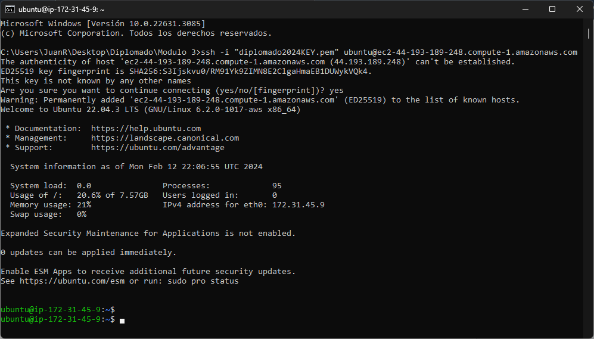

# Prestashop AWS EC2

Guía **paso a paso** para crear una instancia de Amazon EC2, instalar, configurar y personalizar una tienda virtual.

Creación de una instancia EC2 en Amazon AWS


1. Accede a la Consola de AWS:
- Inicia sesión en tu cuenta de Amazon Web Services (AWS).
- Ve al servicio EC2 mediante el buscador

<br>o tambien desde el panel servicios > informatica > EC2


2. Lanzamiento de la instancia:
- Haz clic en **Lanzar la instancia**.

- Asigna un nombre a la instancia.

- Puedes agregar etiquetas adicionales para identificar la instancia si asi lo deseas.

- Selecciona la imagen ubuntu como sistema operativo.

- Elige el tipo de instancia (por ejemplo, t2.micro para una instancia de prueba gratuita).

- Creamos un par de claves para acceder a la instancia de forma segura

<br>o por el contrario asignamos un par de claves ya existen.<br>

- Configuración de red.<br>

- Configura el almacenamiento (puedes usar el valor predeterminado o personalizarlo).

- Verifica la configuración antes de lanzar la instancia.
- Detalles de la instancia ec2 creada.


3. Asignar y asociar ip elastica:
- click en asignar ip elastica

- luego en asignar

- seleccionamos la ip elestica creada, desplegamos las opciones de **acciones** y damos click en asociar.

- seleccionamos la instancia la cual sera asociada esta ip elastica y marcamos la casilla **Permitir que se vuelva a asociar esta dirección IP elastica**

esto nos evitara que la ip publica cambie con el pasar del tiempo.

4. Conectar la instancia por medio del protocolo **ssh**:
    
- Volvemos al apartado de instancias, teniendo seleccionada la instancia damos clic en **conectar**


- luego nos digimos a la opcion **cliente ssh** y utiliza el par de claves para conectarte a la instancia mediante SSH.


- Entramos a cmd desde la carpeta donde guardo el par de claves.

    
- pegamos el ssh y ya nos encontrariamos dentro de nuestra instancia.


## Instalación y configuración de la tienda virtual

- Primero actualizamos los repositorios
➡️ ```sudo apt-get update```


- Luego instalamos **MySQL, Apache y PHP**
➡️ ```sudo apt install -y apache2 libapache2-mod-php php-mysql mariadb-server```


- Revisamos que **MySQL y Apache** esten en ejecución
➡️ ```sudo systemctl status apache2 mariadb```


- Iniciamos sesión en **MySQL** ➡️ ```sudo mysql -u root -p```


- Creamos nuestra base de datos para **Prestashop** ➡️ ```create database burgerland charset utf8mb4 collate utf8mb4_unicode_ci;```

**Nota:** renombrar **burgerland** por el nombre que desees poner a tu base de datos.

- Creamos el usuario ➡️ ```create user user_burgerland@localhost identified by '123';```

**Nota:** renombrar **user_burgerland** por el nombre de usuario que desees poner.

- Brindamos los permisos necesarios al usuario previamente ➡️ ```grant all privileges on burgerland.* to user_burgerland@localhost;```

**Nota:** renombrar **burgerland** y **user_burgerland** por la base de datos y el nombre de usuario que previamente creamos.

- Recargar los privilegios del sistema ➡️ ```flush privileges;```


- Ingresamos a la ruta ➡️ ```cd /var/www/html/```, luego descargamos **Prestashop v8.1.3** ➡️ ```sudo wget https://github.com/PrestaShop/PrestaShop/releases/download/8.1.3/prestashop_8.1.3.zip```

**Nota:** Si deseas descargar otra versión diferente dar click **[aqui](https://github.com/PrestaShop/PrestaShop/releases)** 

- Instalamos el módulo **zip** ➡️ ```sudo apt install zip unzip```


- Descomprimir el archivo **.zip** descargado ➡️ ```sudo unzip prestashop_8.1.3.zip```


- Crear una carpeta para el nombre de la tienda ➡️ ```sudo mkdir burgerland```, luego movemos el **.zip** que se nos genero a la carpeta previamente creada ➡️ ```sudo mv prestashop.zip burgerland``` y por ultimo ingresamos a la carpeta ➡️ ```cd burgerland```


- Descomprimir **prestashop.zip** ➡️ ```sudo unzip prestashop.zip```


- Nos direccionamos hacia ➡️ ```cd /var/www/``` y damos permiso a la carpeta **html** ➡️ ```sudo chown -R www-data:www-data html```


- Instalamos las dependencias que necesita **Prestashop** ➡️ ```sudo apt install -y php-{cli,common,curl,zip,gd,mysql,xml,mbstring,json,intl}```


- Reiniciamos el servicio **apache2** ➡️ ```sudo service apache2 restart```
