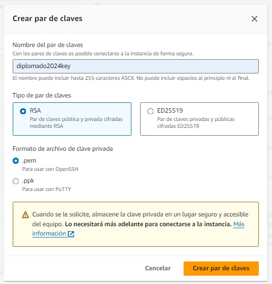

# Prestashop AWS EC2


Guía **paso a paso** para crear una instancia de Amazon EC2, instalar, configurar y personalizar una tienda virtual.

### Creación de una instancia EC2 en Amazon AWS

1. Accede a la Consola de AWS:
- Inicia sesión en tu cuenta de Amazon Web Services (AWS).
- Ve al servicio EC2 mediante el buscador

<br>o tambien desde el panel servicios > informatica > EC2


2. Lanzamiento de la instancia:
- Haz clic en **Lanzar la instancia**.

- Asigna un nombre a la instancia.

- Puedes agregar etiquetas adicionales para identificar la instancia si asi lo deseas.

- Selecciona la imagen ubuntu como sistema operativo.

- Elige el tipo de instancia (por ejemplo, t2.micro para una instancia de prueba gratuita).

- Creamos un par de claves para acceder a la instancia de forma segura

<br>o por el contrario asignamos un par de claves ya existen.<br>

- Configuración de red.<br>

- Configura el almacenamiento (puedes usar el valor predeterminado o personalizarlo).

- Verifica la configuración antes de lanzar la instancia.
- Detalles de la instancia ec2 creada.


3. Asignar y asociar ip elastica:
- click en asignar ip elastica

- luego en asignar

- seleccionamos la ip elestica creada, desplegamos las opciones de **acciones** y damos click en asociar.

- seleccionamos la instancia la cual sera asociada esta ip elastica y marcamos la casilla **Permitir que se vuelva a asociar esta dirección IP elastica**

esto nos evitara que la ip publica cambie con el pasar del tiempo.

4. Conectar la instancia por medio del protocolo **ssh**:
    
- Volvemos al apartado de instancias, teniendo seleccionada la instancia damos clic en **conectar**


- luego nos digimos a la opcion **cliente ssh** y utiliza el par de claves para conectarte a la instancia mediante SSH.


- Entramos a cmd desde la carpeta donde guardo el par de claves.

    
- pegamos el ssh y ya nos encontrariamos dentro de nuestra instancia.


### Instalación y configuración de la tienda virtual

- Primero actualizamos los repositorios
➡️ ```sudo apt-get update```


- Luego instalamos **MySQL, Apache y PHP**
➡️ ```sudo apt install -y apache2 libapache2-mod-php php-mysql mariadb-server```


- Revisamos que **MySQL y Apache** esten en ejecución
➡️ ```sudo systemctl status apache2 mariadb```


- Iniciamos sesión en **MySQL** ➡️ ```sudo mysql -u root -p```


- <a id="bd"></a>Creamos nuestra base de datos para **Prestashop** ➡️ ```create database burgerland charset utf8mb4 collate utf8mb4_unicode_ci;```

**Nota:** renombrar **burgerland** por el nombre que desees poner a tu base de datos.

- <a id="user"></a>Creamos el usuario ➡️ ```create user user_burgerland@localhost identified by '123';```

**Nota:** renombrar **user_burgerland** por el nombre de usuario que desees poner.

- Brindamos los permisos necesarios al usuario previamente creado ➡️ ```grant all privileges on burgerland.* to user_burgerland@localhost;```

**Nota:** renombrar **burgerland** y **user_burgerland** por la base de datos y el nombre de usuario que previamente creamos.

- Recargar los privilegios del sistema ➡️ ```flush privileges;```


- Ingresamos a la ruta ➡️ ```cd /var/www/html/```, luego descargamos **Prestashop v8.1.3** ➡️ ```sudo wget https://github.com/PrestaShop/PrestaShop/releases/download/8.1.3/prestashop_8.1.3.zip```

**Nota:** Si deseas descargar otra versión diferente dar click **[aquí](https://github.com/PrestaShop/PrestaShop/releases)**, pero tener en cuenta que **dependencias** necesita dicha versión

- Instalamos el módulo **zip** ➡️ ```sudo apt install zip unzip```


- Descomprimir el archivo **.zip** descargado ➡️ ```sudo unzip prestashop_8.1.3.zip```


- <a id="carpeta"></a>Crear una carpeta para el nombre de la tienda ➡️ ```sudo mkdir burgerland```, luego movemos el **.zip** que se nos genero a la carpeta previamente creada ➡️ ```sudo mv prestashop.zip burgerland``` y por ultimo ingresamos a la carpeta ➡️ ```cd burgerland```
<a name="carpeta"></a>

- Descomprimir **prestashop.zip** ➡️ ```sudo unzip prestashop.zip```


- Nos vamos hacia ➡️ ```cd /var/www/``` y damos permiso a la carpeta **html** ➡️ ```sudo chown -R www-data:www-data html```


- Instalamos las dependencias que necesita **Prestashop** ➡️ ```sudo apt install -y php-{cli,common,curl,zip,gd,mysql,xml,mbstring,json,intl}```


- Reiniciamos el servicio **apache2** ➡️ ```sudo service apache2 restart```


- <a id="web"></a>Copiamos la **IP elástica** ➡️ ```44.193.189.248/burgerland```

**Nota:** **44.193.189.248** ➡️ es la **IP elástica** de su instancia donde instalo prestashop, **burgerland** ➡️ es el nombre de la carpeta creada en este **[paso](#carpeta)**

- Seleccionamos el **idioma** de preferencia


- Aceptamos **términos y condiciones**


- Nos saldrá este error porque aun no tenemos habilitado el módulo de **a2enmod rewrite**

para poder habilitar el modulo de **a2enmod rewrite** ejecutamos el siguiente comando ➡️ ```sudo a2enmod rewrite```

y damos clic en **Actualizar información**


- Registramos **la información sobre tu tienda**


- Dejamos esta parte **por defecto**


- Registramos el nombre de la **[base de datos](#bd)**, el nombre de **[usuario y contraseña](#user)** y por ultimo **comprobamos la conexion con la base de datos**


- **Prestashop** nos recomienda eliminar la carpeta **install** por razones de seguridad

entramos a la carpeta de nuestra tienda ➡️ ```cd html/burgerland``` y ejecutamos el siguiente comando para borrarla ➡️ ```sudo rm -r install```


- <a id="por_defecto"></a>Para entrar a la página ➡️ ```44.193.189.248/burgerland``` teniendo en cuenta estas **[especificaciones](#web)**


- <a id="admin"></a>Para entrar al administrador ➡️ ```44.193.189.248/burgerland/admin/```


- Puedes realizar los cambios necesarios para personalizar tu tienda ya que por defecto viene instalado este **[tema](#por_defecto)**.


- Aqui un simple cambio


> [!IMPORTANT]
> en caso de encontrarse con el siguiente error al ingresar al administrador de esta **[forma](#admin)**<br>
<br>
Ingrese a la carpeta donde instalo **prestashop** ➡️ ```cd /var/www/html/burgerland``` y renombra la carpeta **admin...** ➡️ ```sudo mv admin313mltutiw29zaay9xz/ admin```


> [!NOTE]
> <br>**admin313mltutiw29zaay9xz** ➡️ los números y letras **313mltutiw29zaay9xz** despues de **admin** varian para cada persona, busca la carpeta que empiece por **admin**.<br>
**admin** ➡️ es el nuevo nombre de la carpeta **admin313mltutiw29zaay9xz**
